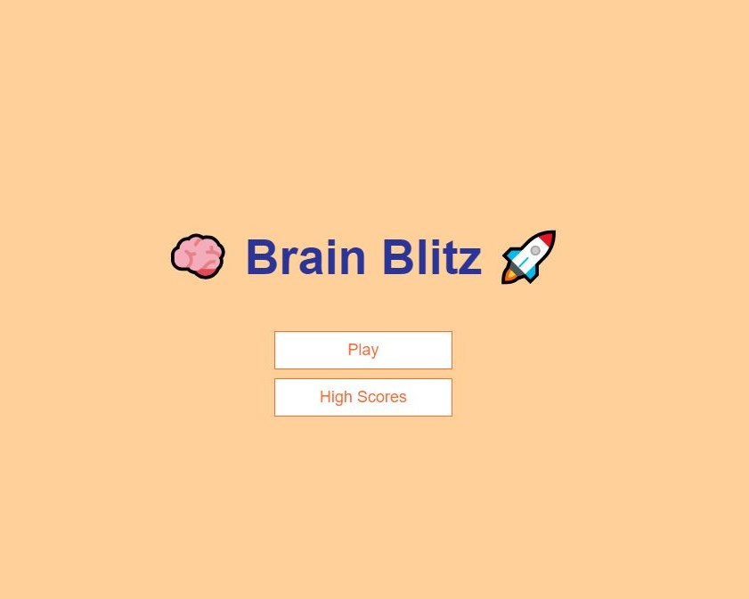
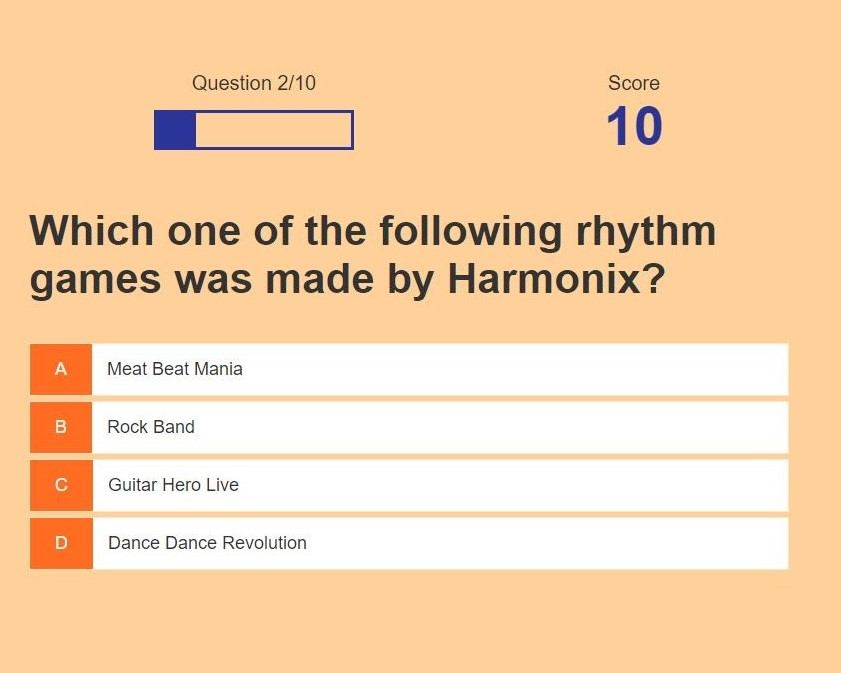

# Brain Blitz

Bienvenido a Brain Blitz, un juego interactivo para poner a prueba tus conocimientos. Este sencillo juego ha sido desarrollado utilizando HTML, CSS y JavaScript. Las preguntas y respuestas provienen de la API Open Trivia Database.

## Instrucciones

1. Descarga o clona este repositorio en tu máquina local.
2. Abre el archivo `index.html` en tu navegador web.
3. ¡Prepárate para desafiar tu mente! Responde preguntas de diversas categorías y demuestra cuánto sabes.

## Características

- **Diversidad de Categorías:** Disfruta de preguntas en una amplia variedad de categorías, desde ciencia hasta cultura general.
- **Puntuación:** Rastrea tu puntuación y compárala con amigos o desafía tu propio récord.

## Tecnologías Utilizadas

- HTML
- CSS
- JavaScript

## Obtención de Preguntas y Respuestas

Este juego utiliza la API Open Trivia Database para obtener preguntas y respuestas. Asegúrate de tener una conexión a Internet activa para disfrutar de la experiencia completa.

## Capturas de Pantalla

---

¡Diviértete y disfruta poniendo a prueba tu mente con Brain Blitz!
